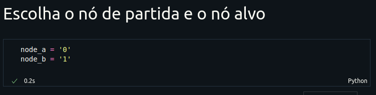
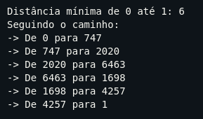
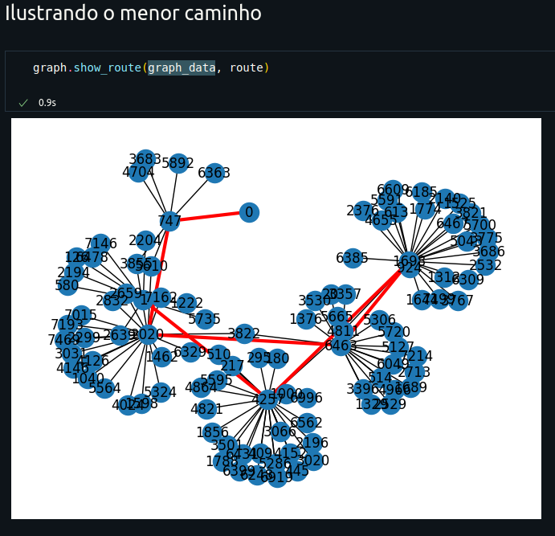
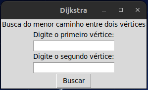
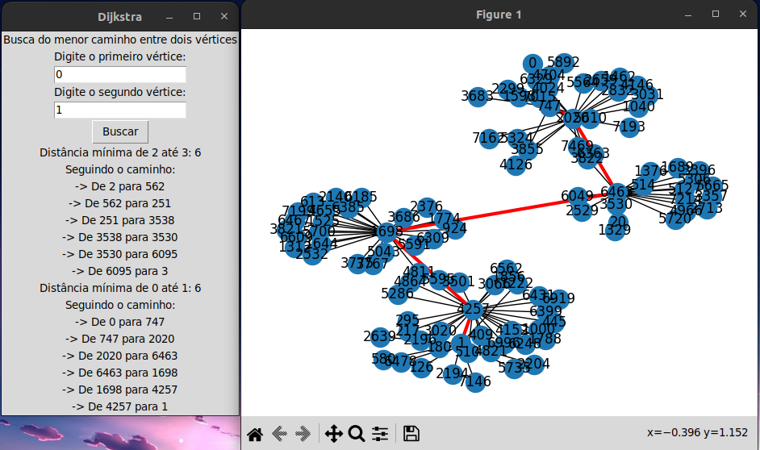

<p align="center">
  
</p>
<p align="center">UNIVERSIDADE FEDERAL DE PERNAMBUCO-UFPE</p>
<p align="center">CENTRO DE INFORMÁTICA</p>

##

<p align="center">
  
  
  
</p>

# Projeto: Busca do menor caminho entre dois nós usando algorítimo de Dijkstra

## 📋 Sobre

O projeto aplica o algorítimo de Dijkstra na busca da menor distância entre usuários da rede social "<a href="http://snap.stanford.edu/data/feather-lastfm-social.html">Last.f Asia</a>". Para executar o programa, disponibilizamos duas alternativas. A primeira consiste em um Jupyter Notebook, main.ipynb, onde é possível acompanhar a evolução etapa por etapa seguindo o fluxo das celúlas. A segunda permite interação com o programa a partir de uma interface executando o arquivo <span>main.py</span>.

## 📂 Estrutura do projeto

```
dijkstra-algorithm
├── README.md
├── data_base
|  ├── README.txt
|  ├── lastfm_asia_edges.csv
|  ├── lastfm_asia_features.json
|  └── lastfm_asia_target.csv
├── main.ipynb
├── main.py
└── modules
   ├── __init__.py
   ├── data.py
   ├── dijkstra.py
   ├── graph.py
   └── setup.py

```

## 🚀 Rodando o projeto

### A partir do Jupyter Notebook

1. Abra o notebook
2. Escolha o nó de partida e o nó de chegada atribuindo as variáveis node_a e node_b
  
3. Execute o notebook
4. Acompanhe os resultados
  4.1 Rota percorrida
  
  4.2 Grafo
  

### A partir da interface gráfica

1. Execute o arquivo <span>main.py</span>

   Executando via terminal
   Na pasta do projeto execute:

   > python3 main.py

   Executando via Code Runner
   Abra o arquivo main.py e clique em executar (botão Code Runner) ou pelo atalho (ctrl + Alt + N)

2. Selecione o valor dos nós na interface e clique em "Buscar"
  

3. Acompanhe o resultado pelo log na interface e pelo grafo
  
## 🛠️ Tecnologias utilizadas

- Python3
- Jupter Notebook

### Bibliotecas
- csv
- typing
- networkx
- matplotlib
- tkinter

## ✒️ Autores

| [<br><sub>Hítalo Nascimento</sub>](https://github.com/HitaloNasc) | [<br><sub>Ingrid Freire</sub>](https://github.com/ingridfsl) |
| :-----------------------------------------------------------------------------------------------------------------------------------------: | :-------------------------------------------------------------------------------------------------------------------------------------: |
